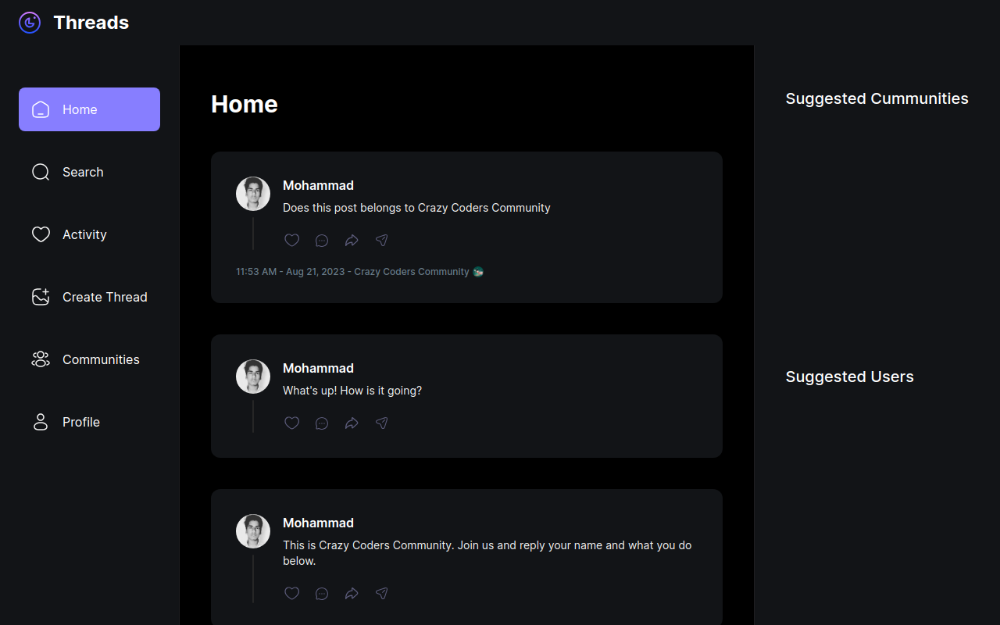

# Nextbird Project

Nextbird is a social media application built using the following technologies:

- Next.js
- TypeScript
- MongoDB
- Tailwind CSS
- Shadcn UI
- Clerk (for authentication)
- UploadThing (for handling image uploads)

This project serves as a practical implementation of concepts learned from a YouTube tutorial, with additional features and enhancements planned to be developed independently.



## Features

- User authentication and authorization using Clerk.
- Post creation and viewing.
- Commenting on posts.
- Image uploads handled by UploadThing.
- Responsive design with Tailwind CSS and Headless UI components.

## Getting Started

To get started with the project, follow these steps:

1. Clone the repository: `git clone https://github.com/md-talim/nextbird.git`
2. Navigate to the project directory: `cd nextbird`
3. Install the dependencies: `yarn`
4. Create a `.env.local` file in the root directory and add the following environment variables:

   ```
   NEXT_PUBLIC_CLERK_PUBLISHABLE_KEY=XXX
   CLERK_SECRET_KEY=XXX
   NEXT_CLERK_WEBHOOK_SECRET=XXX
   NEXT_PUBLIC_CLERK_SIGN_IN_URL=/sign-in
   NEXT_PUBLIC_CLERK_SIGN_UP_URL=/sign-up
   NEXT_PUBLIC_CLERK_AFTER_SIGN_IN_URL=/onboarding
   NEXT_PUBLIC_CLERK_AFTER_SIGN_UP_URL=/onboarding
   MONGODB_PASS=XXX
   MONGODB_URL=XXX
   UPLOADTHING_SECRET=XXX
   UPLOADTHING_APP_ID=XXX
   ```

5. Run the development server: `yarn run dev`
6. Open your browser and visit: `http://localhost:3000`

## Additional Features (To-Do)

The Nextbird project aims to go beyond the tutorial by implementing the following features:

- [ ] **Like Posts:** Allow users to like posts and display the total number of likes.
- [ ] **Delete Posts:** Implement the ability for users to delete their own posts.
- [ ] **Search for Accounts:** Develop a search functionality to find user accounts.

## Contributing

Contributions are welcome! If you would like to contribute to this project by adding new features, fixing bugs, or enhancing the user experience, please follow these steps:

1. Fork the repository.
2. Create a new branch for your feature: `git checkout -b feature-name`
3. Make your changes and commit them: `git commit -m "Add feature-name"`
4. Push to the branch: `git push origin feature-name`
5. Create a pull request outlining your changes.

## Acknowledgements

This project was initially built by following a YouTube tutorial (provide link or tutorial name). The foundational structure and concepts were learned from this resource. The enhancements and additional features were developed independently by the owner of this repository.

## License

This project is licensed under the [MIT License](LICENSE).
